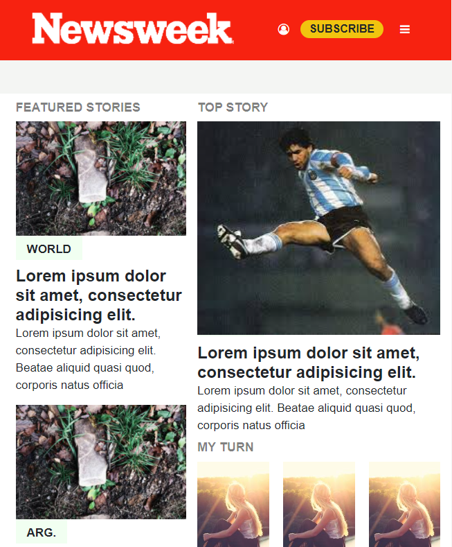

# Responsive Design
This project's purpose is to recreate the webpage https://nextweek.com focusing on learning the basics of the bootstrap framework

## Built With

- HTML5, CSS3, BOOTSTRAP

## Live Demo
https://rawcdn.githack.com/KennyUTN/Using--Bootstrap--Kenny/b4a894dd4fc0d39a87478e567c930b1a6e0fc012/index.html
## Author

👤 **Juan Ignacio Asis**

- Github: [@KennyUTN](https://github.com/KennyUTN)
- Twitter: [@Kenny11614766](https://twitter.com/Kenny11614766)
- Linkedin: [linkedin](https://www.linkedin.com/in/ignacio-asis-b8214b183/)

## 🤝 Contributing

Contributions, issues, any kind of feedback and feature requests are welcome!

## Show your support

Give a ⭐️ if you like this project!

## Acknowledgments

-I focused a lot of time on learning the basics of bootstrap and didn't pay much attention or wasted much time in trying to do a 100% lookalike recreation.

## 📝 License

This project has no license
